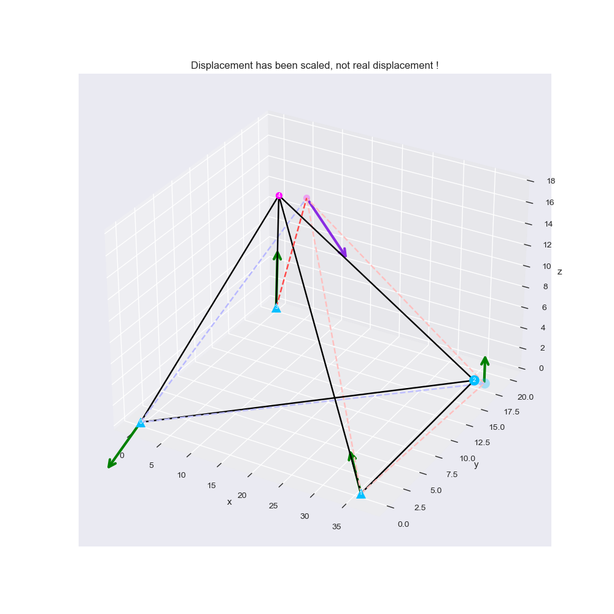
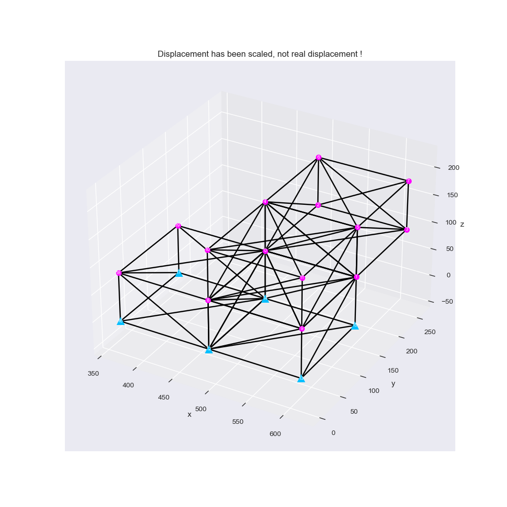

# **slientruss3d** : Python for stable truss analysis and optimization tool

[](https://pypi.org/project/slientruss3d/)
[](https://pypi.org/project/slientruss3d/)
[](https://github.com/leo27945875/Python_Stable_3D_Truss_Analysis/releases)
[](https://pypi.org/project/slientruss3d/)
[](https://pypi.org/project/slientruss3d/)
[](https://github.com/leo27945875/Python_Stable_3D_Truss_Analysis/blob/master/LICENSE.txt)

---

## Description

**`slientruss3d`** is a python package which can solve the resistances, internal forces and joint dispalcements in a stable 2D or 3D truss by `direct stiffness method`. And also can do truss optimization by `Genetic Algorithm (GA)`, `generate truss data` and `work with pytorch-geometric` conveniencely.  
  
This repo is writen by  :

```text
Taiwan                                          (臺灣)
Department of Civil Engineering                 (土木工程學系)
National Yang Ming Chiao Tung University (NYCU) (國立陽明交通大學)
Shih-Chi Cheng                                  (鄭適其)
```



## Content

1. **Installaltion**
    - [Install](#Install)
    - [Time consuming](#Time-consuming)
    - [Update log](#Update-log)
2. **Quick start**
    - [Basic example](./detail/how_to_use.md#Basic-example) >( Just read this if you aren't familiar with coding 😎 )
    - [Truss](./detail/how_to_use.md#Truss)
    - [Member](./detail/how_to_use.md#Member)
    - [MemberType](./detail/how_to_use.md#Define-a-new-member)
    - [SupportType](./detail/how_to_use.md#Define-a-new-joint)
3. **Combine with JSON**
    - [Example code](./detail/combine_with_JSON.md#Example)
    - [Embed in Web APP](./detail/combine_with_JSON.md#Embed-in-Web-APP)
    - [Format of JSON](./detail/combine_with_JSON.md#Format-of-JSON)
4. **Plot your truss**
    - [Example code](./detail/plot_your_truss.md#Example-code)
    - [Example figures](./detail/plot_your_truss.md#Example-figures)
5. **Truss optimization**
    - [Introduction](./detail/truss_optimization.md#Introduction)
    - [Gene](./detail/truss_optimization.md#Gene-data-structure)
    - [Fitness function](./detail/truss_optimization.md#Fitness-function)
    - [Crossover](./detail/truss_optimization.md#Crossover)
    - [Evolution policy](./detail/truss_optimization.md#Evolution-policy)
    - [Example code](./detail/truss_optimization.md#Example)
    - [Geneic algorithm](./detail/truss_optimization.md#Geneic-algorithm)
    - [Customization](./detail/truss_optimization.md#Customization)
6. **Generate truss data automatically**
    - [Introduction](./detail/gen_truss.md#Introduction)
    - [Generate cube-like truss](./detail/gen_truss.md#Generate-cube-like-truss)
    - [Data Augmentation](./detail/gen_truss.md#data-augmentation)
7. **Graph Deep Learning**
    - [Introduction](./detail/to_PyG.md#introduction)
    - [Installation](./detail/to_PyG.md#installation)
    - [How to use it ?](./detail/to_PyG.md#how-to-use-it)
    - [Fields in HeteroData](./detail/to_PyG.md#fields-in-heterodata)
    - [Example code](./detail/to_PyG.md#example-code)

---

## Install

First, check your python version:

```text
Python must >= 3.9.7
```

Second, download the **`slientruss3d`** package:

```text
pip install slientruss3d 
```

---

## Time consuming

The following are time consuming tests for doing structural analysis for each truss (Each testing runs for 30 times and takes average !).

- **`6-bar truss`**&ensp;&ensp; : 0.00037(s)
- **`10-bar truss`**&ensp; : 0.00050(s)
- **`25-bar truss`**&ensp; : 0.00126(s)
- **`47-bar truss`**&ensp; : 0.00253(s)
- **`72-bar truss`**&ensp; : 0.00323(s)
- **`120-bar truss`** : 0.00557(s)
- **`942-bar truss`** : 0.05253(s)

Testing on :

```text
CPU: Intel(R) Core(TM) i7-10750H CPU @ 2.60GHz
RAM: 8GB DDR4 * 2
```

---

## Update log

### New feature in v2.0.0 update !

- _**Important API adjustment**_ : We `simplified the JSON format` in slientruss3d, see the details in [Format of JSON](./detail/combine_with_JSON.md#Format-of-JSON). You can use the `v1_to_v2.py` module in the root folder to convert the old JSON format to the new one rapidly.

- _**Data Augmentation**_ : You can use some new method in **`slientruss3d.generate`** module to do data augmentation to generated cube-like trusses ! See more details in [Data Augmentation](./detail/gen_truss.md#data-augmentation).  For example:  

<p align="center">
    
    
</p>

- _**Graph Deep Learning**_ : With the increasing importance of deep learning in the field of truss design, we also provide a solution to let our users convert the `Truss` object to the data structure of [`Pytorch-Geometric`](https://github.com/pyg-team/pytorch_geometric) conveniently. See the details in [Convert Truss to Pytorch-Geometric HeteroData](./detail/to_PyG.md#convert-truss-to-pytorch-geometric-heterodata).

<p align="center">
    
</p>

&ensp;  

### An important API adjustment after v1.3.25 !

After slientruss3d v1.3.25, the method [`Truss.Solve()`](./detail/how_to_use.md#Do-structural-analysis) will return `None` instead of the result of structural analysis. If you want to get the result of structural analysis, please use other getters defined in Truss object such as:

```python
# Get result of structural analysis:
displace, stress, resistance = truss.GetDisplacements(), truss.GetInternalStresses(), truss.GetResistances()
return displace, stress, resistance
```

### New feature in v1.3.0 update !

After slientruss3d v1.3.0, you can use **`slientruss3d.generate`** module to generate truss data automatically. For now, only simple `cube-like` truss can be generated by slientruss3d, but I think this is still a helpful way for anyone who suffers from lake of truss data.

> More details are in [Generate truss data automatically](./detail/gen_truss.md)



### New feature in v1.2.0 update !

After slientruss3d v1.2.0, you could use **`slientruss3d.ga`** module to do `member type selection optimization` conveniencely with `Genetic Algorithm (GA)`! Just simply define the topology of the truss and what member types you want to use, and then you could start the optimization.  

> More details are in [Truss optimization](./detail/truss_optimization.md)

Besides GA, there are some new useful methods in the `Truss` object:

```python
class Truss:

    ...

    # Check whether all internal forces are in allowable range or not:
    def IsInternalStressAllowed(self, limit, isGetSumViolation=False) -> tuple[bool, dict | float]: 
        ...

    # Check whether all internal displacements are in allowable range or not:
    def IsDisplacementAllowed(self, limit, isGetSumViolation=False) -> tuple[bool, dict | float]:
        ...

```

---

## Enjoy 😎 !
