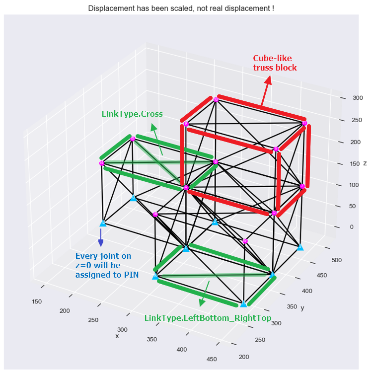

# Generate truss data automatically

After slientruss3d 1.3.x, you can use **`slientruss3d.generate`** to generate truss data automatically. For now, only simple `cube-like` truss can be generated by slientruss3d, but I think this is still a helpful way for anyone who suffers from lake of truss data.

---

## Introduction

The following is an example figure for how `4-cube truss` looks like. And also introduce some technical terms here.



---

## Generate cube-like truss

```python
from slientruss3d.generate import GenerateRandomCubeTrusses

GenerateRandomCubeTrusses(gridRange              = (5, 5, 5), 
                          numCubeRange           = (3, 20), 
                          numCaseRange           = (0, 99), 
                          lengthRange            = (50, 150), 
                          forceRange             = (0, 30000),
                          linkType               = LinkType.Random,
                          method                 = GenerateMethod.DFS,
                          saveFolder             = "./",
                          isDoStructuralAnalysis = False,
                          isPlotTruss            = False,
                          isPrintMessage         = True)

```

- **`gridRange`** : Max range of the `global cube grid`.
- **`numCubeRange`** : Range of the total numbers of cube-like truss block on the global grid.
- **`numCaseRange`** : Range of the numbers of cases for each `numCubeRange`.
- **`lengthRange`** : Range of the edge length (that is, height, width, deepth) for every cube-like truss block.
- **`forceRange`** : Range of the magnitudes for xy(z)-axis of the random forces assigned at joints.
- **`linkType`** : Link type of faces of every cube-like truss block.
- **`method`** : Algorithm to decide positions to generate cube-like truss blocks.
- **`isDoStructuralAnalysis`** : Whether to do structral analysis after each truss be generated.
- **`isPlotTruss`** : Whether to plot the truss after each truss be generated.
- **`isPrintMessage`** : Whether to print the message for the generating progress on the screen.

<br/>

Explanation of `global cube grid` ( `gridRange` = (3, 3, 3), `numCubeRange` = (50, 150) ) :


Options of `linkType`:

>- *LinekType.LeftBottom_RightTop*
>- *LinekType.RightBottom_LeftTop*
>- *LinekType.Cross*
>- *LinekType.Random* &ensp; **(default)**

Options of `method`:

>- *GenerateMethod.DFS* &ensp; **(default)**
>- *GenerateMethod.BFS*
