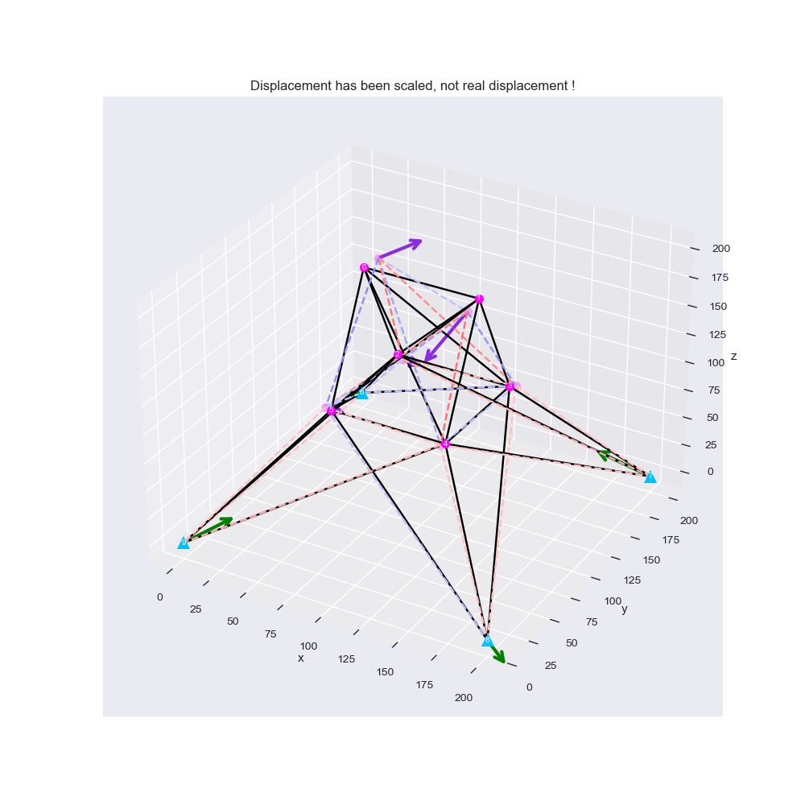
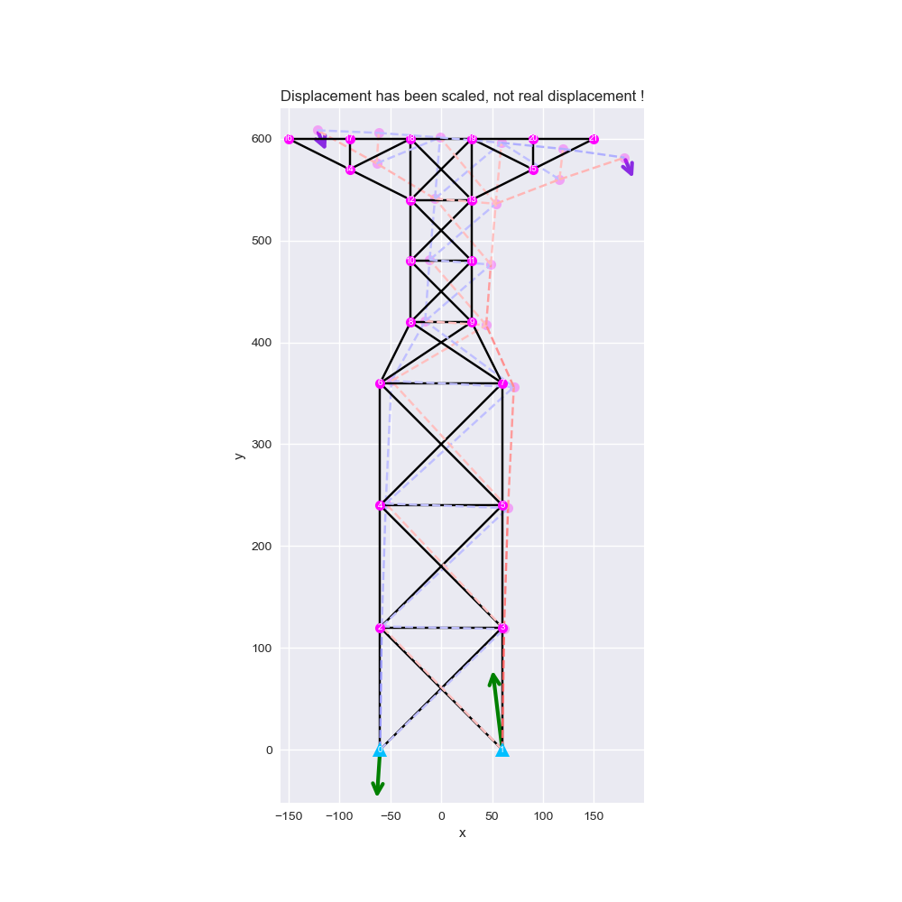
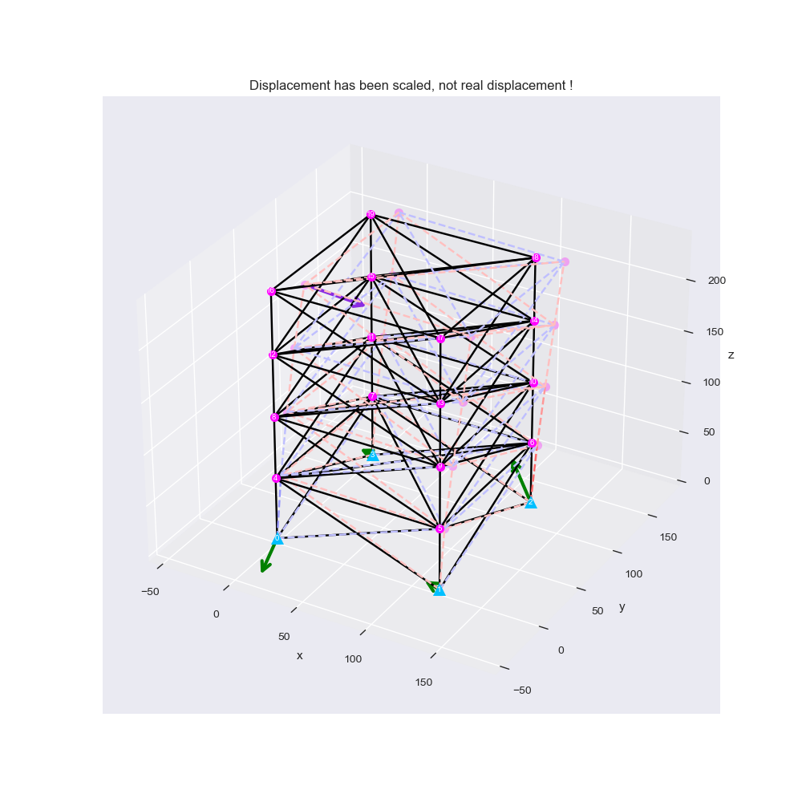
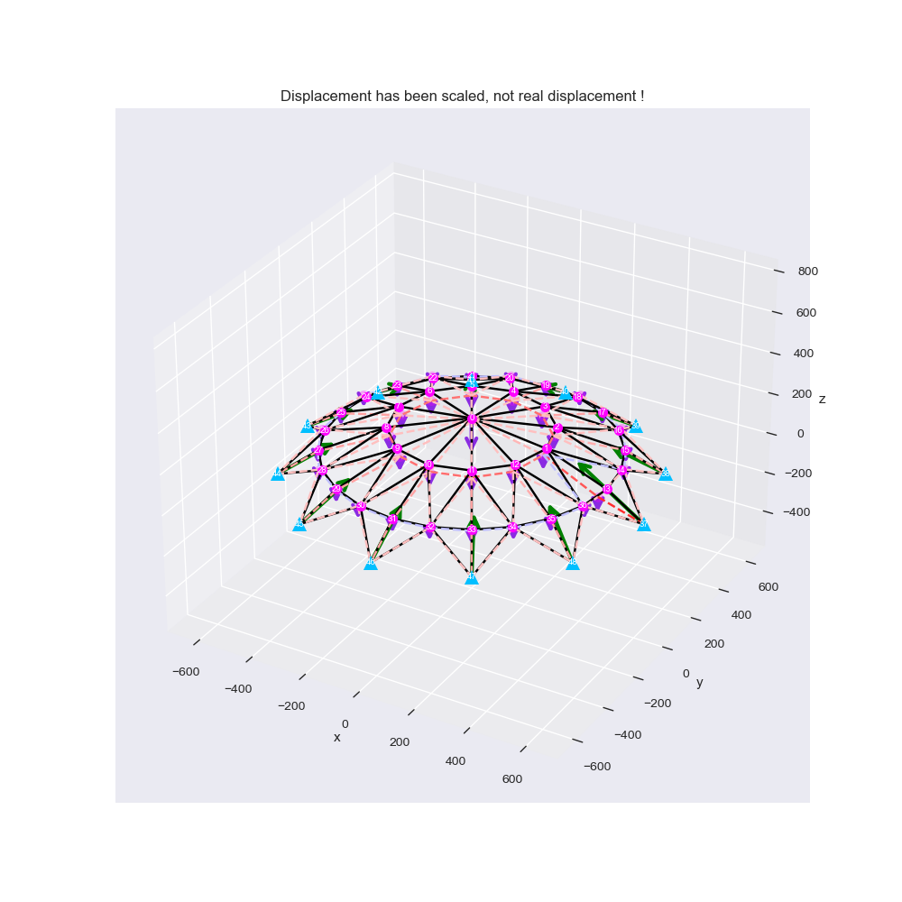
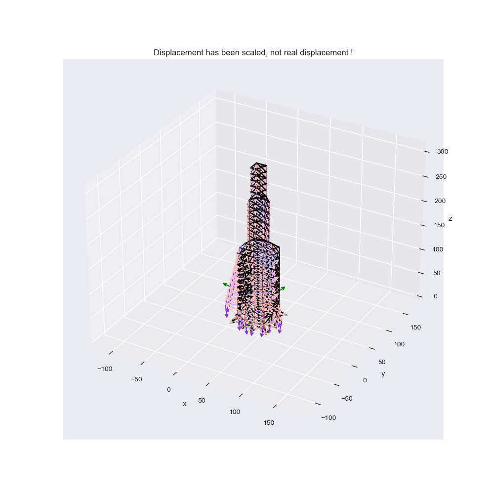

# Plot your truss

## Example code

You could use `slientruss3d.plot.TrussPlotter` to plot the result of structural analysis for your truss. 
See the following example:

```python
from slientruss3d.truss import Truss
from slientruss3d.plot  import TrussPlotter


def TestPlot():
    # -------------------- Global variables --------------------
    # Files settings:
    TEST_FILE_NUMBER        = 25
    TEST_LOAD_CASE          = 0
    TEST_INPUT_FILE         = f"./data/bar-{TEST_FILE_NUMBER}_output_{TEST_LOAD_CASE}.json"
    TEST_PLOT_SAVE_PATH     = f"./plot/bar-{TEST_FILE_NUMBER}_plot_{TEST_LOAD_CASE}.png"

    # Truss dimension setting:
    TRUSS_DIMENSION         = 3

    # Figure layout settings:
    IS_SAVE_PLOT            = False   # Whether to save truss figure or not.
    IS_EQUAL_AXIS           = True    # Whether to use actual aspect ratio in the truss figure or not.
    MAX_SCALED_DISPLACEMENT = 15      # Scale the max value of all dimensions of displacements.
    MAX_SCALED_FORCE        = 50      # Scale the max value of all dimensions of force arrows.
    POINT_SIZE_SCALE_FACTOR = 1       # Scale the default size of joint point in the truss figure.
    ARROW_SIZE_SCALE_FACTOR = 1       # Scale the default size of force arrow in the truss figure.
    # ----------------------------------------------------------

    # Truss object:
    truss = Truss(dim=TRUSS_DIMENSION)

    # You could directly read the output .json file.
    truss.LoadFromJSON(TEST_INPUT_FILE, isOutputFile=True)

    # Show or save the structural analysis result figure:
    TrussPlotter(truss,
                 isEqualAxis=IS_EQUAL_AXIS,
                 maxScaledDisplace=MAX_SCALED_DISPLACEMENT, 
                 maxScaledForce=MAX_SCALED_FORCE,
                 pointScale=POINT_SIZE_SCALE_FACTOR,
                 arrowScale=ARROW_SIZE_SCALE_FACTOR).Plot(IS_SAVE_PLOT, TEST_PLOT_SAVE_PATH)
```

---

## Example figures

- **`Green Arrow`** &ensp;&ensp;: Resistance
- **`Purple Arrow`** &ensp;: External Force
- **`Black Line`** &ensp;&ensp;&ensp;: Member
- **`Blue Dashline`** : Displaced member with tension
- **`Red Dashline`** &ensp;: Displaced member with compression
- **`Pink Circle`** &ensp;&ensp;: Joint
- **`Blue Circle`** &ensp;&ensp;: Roller
- **`Blue Triangle`** : Pin

<br/>

**Input** : `./data/bar-6_output_0.json`


<br/>

**Input** : `./data/bar-10_output_0.json`


<br/>

**Input** : `./data/bar-25_output_0.json`


**Input** : `./data/bar-47_output_0.json`


<br/>

**Input** : `./data/bar-72_output_1.json`


<br/>

**Input** : `./data/bar-120_output_0.json`


<br/>

**Input** : `./data/bar-942_output_0.json`
